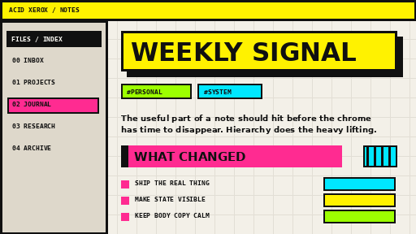

# Acid Xerox

**Acid Xerox** is a bold, colorful neo-brutalist theme for Obsidian, built from the visual language of 1990s zines, photocopied flyers, record sleeves, rave graphics, early desktop publishing, and chunky interface chrome.

It is loud on purpose, but it still has to function as a note-taking environment. The theme uses hard borders, offset shadows, fluorescent accents, condensed display typography, highlighted navigation, visible hierarchy, and a paper-grid writing surface while keeping body text readable.



## Design language

- Electric yellow, magenta, cyan, acid green, ultramarine, black, and warm paper.
- Square corners everywhere.
- Thick rules and visible structure instead of soft cards.
- Offset print-style shadows rather than blur.
- Oversized poster headings.
- Monospace micro-labels and metadata.
- Strong hover / active states for navigation.
- Light and dark themes with the same visual DNA.
- No external fonts, images, or web assets.

## Install manually

1. Download `theme.css` and `manifest.json`.
2. Create a folder named `Acid Xerox` inside your vault at `.obsidian/themes/`.
3. Put both files in that folder.
4. Open **Settings → Appearance → Themes** and select **Acid Xerox**.

## Optional CSS classes

Add these in a note's frontmatter under `cssclasses`:

```yaml
cssclasses:
  - poster
```

`poster` makes the H1 treatment deliberately louder, with stacked fluorescent offset shadows.

```yaml
cssclasses:
  - index-card
```

`index-card` turns the note canvas into a bordered paper card with a hard magenta shadow.

## Publishing to the Obsidian Community directory

For the first release:

1. Push this repository to GitHub.
2. Replace `images/screenshot.png` with a fresh 512×288 screenshot taken from the current theme if you have changed the design.
3. Create a GitHub release tagged `1.0.0`.
4. Attach `manifest.json` and `theme.css` to the release.
5. Submit the repository through the Obsidian Community directory.

For later releases, bump the semantic version in `manifest.json`, tag the same version on GitHub, and attach the updated `manifest.json` and `theme.css` to the release.

## Theme philosophy

Most productivity software whispers. Acid Xerox uses a megaphone. The interface should feel authored rather than anesthetized: visible edges, decisive hierarchy, color that carries meaning, and enough friction to give the workspace a physical presence.

The chaos is controlled. Body copy stays calm. Navigation, headings, metadata, state changes, callouts, and controls carry the visual voltage.

## Compatibility

- Designed for modern desktop and mobile Obsidian.
- Minimum app version declared in `manifest.json`: `1.5.0`.
- No external assets.
- No `!important` rules.
- No `:has()` selectors.

## License

MIT. See [LICENSE](./LICENSE).
